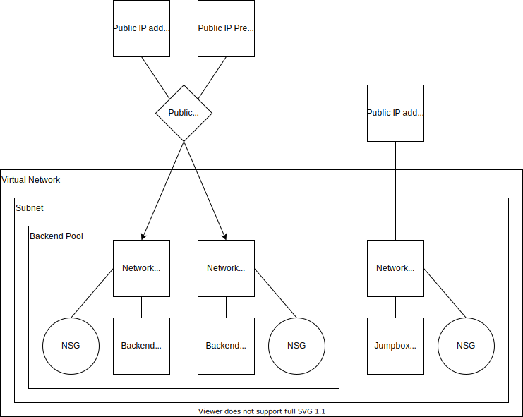

# Select set of public IP addresses for outbound connections in Public Standard load balancer

## Template overview

Groom outbound connections to a specific set of public IP addresses in Public Standard load balancer.

### Deployments

All the below names are the default value.

- Resource group: `demo-lb-std-pub-select-outbound-ip`
- Public Standard load balancer: `lboutip-lb`
    - Public IP address: `lboutip-lb-in-ip`
    - Public IP Prefix: `lboutip-lb-out-ip`
- Virtual network: `lboutip-vnet`
    - IPv4 address space: `10.0.0.0/16`
    - Subnet: `default`
        - Address prefix: `10.0.0.0/24`
        - Virtual machine: `lboutip-backend-vm1`
            - Virtual machine in the backend of the load balancer.
            - OS disk: `lboutip-backend-vm1-osdisk`
            - Network interface: `lboutip-backend-vm1-nic`
                - Private IP address: `10.0.0.10`, Static
            - Network security group: `lboutip-backend-vm1-nsg`
        - Virtual machine: `lboutip-backend-vm2`
            - Virtual machine in the backend of the load balancer.
            - OS disk: `lboutip-backend-vm2-osdisk`
            - Network interface: `lboutip-backend-vm2-nic`
                - Private IP address: `10.0.0.11`, Static
            - Network security group: `lboutip-backend-vm2-nsg`
        - Virtual machine: `lboutip-jump-vm1`
            - For RDP connection from Internet.
            - OS disk: `lboutip-jump-vm1-osdisk`
            - Network interface: `lboutip-jump-vm1-nic`
                - Private IP address: `10.0.0.5` - Static
            - Public IP address: `lboutip-jump-vm1-ip`
            - Network security group: `lboutip-jump-vm1-nsg`

### Non-deployments

- n/a

### Diagram

## Notes

- The backend virtual machines have Web Server role (IIS) installed.
- The jump virtual machine has Wireshark and Chromium Edge installer under "C:\\work".
- The deploy.ps1 script needs [Az module](https://www.powershellgallery.com/packages/Az/).
